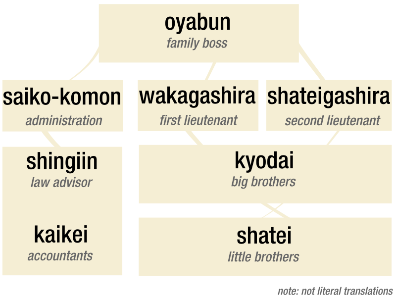

## Genki Gumi 😊

[Yakuza-inspired](https://en.wikipedia.org/wiki/Yakuza) decentralized autonomous organization ([DAO](https://en.wikipedia.org/wiki/Decentralized_autonomous_organization)) focused on managing and operating digital assets to realize utility; income, growth and external influence.

### Structure

Genki Gumi [gg] follows a traditional Yakuza family structure, headed by an _Oyabun_ and broken into two sections, _saiko-komon_ (administration - planning) and _gashira_ (lieutenant - execution). It is intended that the _Oyabun_ will be an automated role, executed by contracts via votes cast by all members. 

_* note: this chart was taken from a google search and will eventually be altered to reflect gg roles more accurately_

For more details see [Basic writing and formatting syntax](https://docs.github.com/en/github/writing-on-github/getting-started-with-writing-and-formatting-on-github/basic-writing-and-formatting-syntax).

### Jekyll Themes

Your Pages site will use the layout and styles from the Jekyll theme you have selected in your [repository settings](https://github.com/PositiveControl/genki/settings/pages). The name of this theme is saved in the Jekyll `_config.yml` configuration file.

### Support or Contact

Having trouble with Pages? Check out our [documentation](https://docs.github.com/categories/github-pages-basics/) or [contact support](https://support.github.com/contact) and we’ll help you sort it out.
