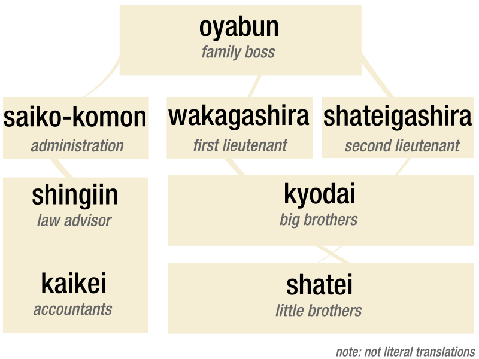

[< Back](./)
### Structure
Genki-gumi [gg] *may* follow a traditional Yakuza family structure, headed by an _Oyabun_ and broken into two sections, _saiko-komon_ (administration - planning) and _gashira_ (lieutenant - execution). It is intended that the _Oyabun_ will be an automated role, executed by contracts via votes cast by all members. 

_* note: this chart was taken from a google search and will eventually be altered to reflect gg roles more accurately_

[< Back](./)
